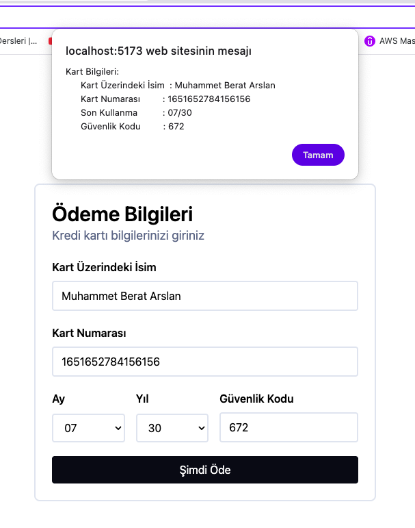

# Credit Card Payment UI

Modern bir kredi kartı ödeme formu UI'ı. React, TypeScript, Vite ve Tailwind CSS kullanılarak geliştirilmiştir.

## Proje Yapısı

```
src/
├── components/
│   ├── Card.tsx          # Ana kredi kartı formu
│   └── ui/
│       ├── Dropdown.tsx  # Ay/Yıl dropdown bileşeni
│       └── Input.tsx      # Form input bileşeni
├── utils/
│   └── data.ts           # Ay ve yıl verileri
└── App.tsx
```

## Çıktı Önizlemesi



## Kurulum

```bash
# Bağımlılıkları yükle
npm install

# Geliştirme sunucusunu başlat
npm run dev
